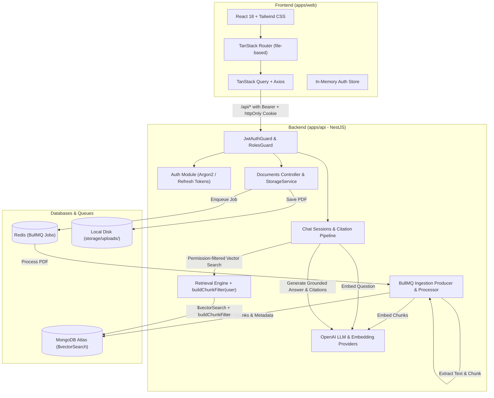

# School ERP Copilot

A role-aware RAG assistant embedded in a school ERP: admins upload PDFs, teachers and parents ask questions and get cited answers.



## Quick Start

### 1. Prerequisites

- Node.js >= 20
- pnpm >= 10
- Docker & Docker Compose (or local MongoDB Atlas & Redis)

### 2. Environment Setup

Copy the example environment configuration:

```bash
cp .env.example .env
cp .env.example apps/api/.env
```

Fill in your `OPENAI_API_KEY` in `apps/api/.env`.

### 3. Start Database & Redis

```bash
docker compose up -d
```

### 4. Install Dependencies & Build Packages

```bash
pnpm install
pnpm build
```

### 5. Seed Synthetic Data

```bash
pnpm seed
```

### 6. Run Development Servers

```bash
pnpm dev
```

- API runs at `http://localhost:3000` (Swagger docs at `http://localhost:3000/api/docs`)
- Web runs at `http://localhost:5173`

---

## Demo Credentials (Synthetic)

All accounts share the default password: `Password123!`

| Role    | Email                          | Description                                             |
| ------- | ------------------------------ | ------------------------------------------------------- |
| ADMIN   | `admin@school.local`           | Full document & audience control, chats across all docs |
| TEACHER | `teacher.math@school.local`    | Assigned to Class 8-A and Class 10-A                    |
| TEACHER | `teacher.english@school.local` | Assigned to Class 6-A                                   |
| PARENT  | `parent.smith@school.local`    | Child in Class 8-A                                      |
| PARENT  | `parent.doe@school.local`      | Child in Class 6-A                                      |
| PARENT  | `parent.khan@school.local`     | Child in Class 10-A                                     |

---

## Evaluation Harness

To run the automated benchmark evaluating answer accuracy, citation hit rate, and permission isolation:

```bash
pnpm eval
```

Eval results are stored in `evals/results/<timestamp>.json`.

---

## Known Limitations

- V1 does not perform OCR on scanned PDFs (unextractable text is rejected safely).
- Single-tenant deployment model.
