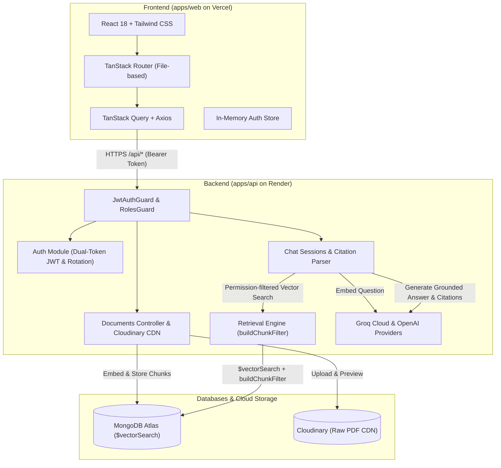

# School ERP Copilot

> A role-governed, citation-backed RAG (Retrieval-Augmented Generation) assistant embedded in a K-12 School ERP system.

[](https://school-copilot-ruddy.vercel.app)
[](https://www.typescriptlang.org/)
[](https://nestjs.com/)
[](https://react.dev/)
[](https://www.mongodb.com/atlas)
[](https://console.groq.com)

---

## 🌐 Live Application

- **Live URL**: **[https://school-copilot-ruddy.vercel.app](https://school-copilot-ruddy.vercel.app)**
- **Architecture**: React 18 SPA hosted on **Vercel** + NestJS 10 API hosted on **Render** + **MongoDB Atlas** Vector Search + **Cloudinary** Raw PDF CDN + **Groq** LLM inference.

---

## 🔑 Demo Test Accounts

The live login page features a **1-click quick persona switcher** for instant evaluation.

All accounts use the default password: `Password123!`

| Role                  | Email                          | Permissions & Accessible Scope                                                                                |
| :-------------------- | :----------------------------- | :------------------------------------------------------------------------------------------------------------ |
| **Administrator**     | `admin@school.local`           | Full repository control, document ingestion, audience/class RBAC assignment, unconstrained AI chat.           |
| **Faculty / Teacher** | `teacher.math@school.local`    | Access to Teacher-scoped documents (Staff Leave Policy, Exam Schedules) for **Class 8-A** and **Class 10-A**. |
| **Faculty / Teacher** | `teacher.english@school.local` | Access to Teacher-scoped documents for **Class 6-A**.                                                         |
| **Guardian / Parent** | `parent.smith@school.local`    | Access to Parent-scoped documents (Fee structures, Holiday calendars) for child enrolled in **Class 8-A**.    |
| **Guardian / Parent** | `parent.doe@school.local`      | Access to Parent-scoped documents for child enrolled in **Class 6-A**.                                        |
| **Guardian / Parent** | `parent.khan@school.local`     | Access to Parent-scoped documents for child enrolled in **Class 10-A**.                                       |

---

## 💡 Key Architectural Pillars

### 1. Pre-Retrieval Zero-Trust RBAC (Zero Permission Leakage)

Instead of naive post-retrieval filtering (which risks leaking data or returning empty results when top matches are unauthorized), **School ERP Copilot** enforces permissions directly inside MongoDB's `$vectorSearch` query:

- Every chunk denormalizes `allowedRoles` and `classScope`.
- Queries are strictly pre-filtered by the user's authenticated JWT claims before cosine similarity search runs.
- **Result**: Parents cannot query confidential staff salary/leave documents, and Class 6 parents cannot query Class 8 circulars.

### 2. Strictly Grounded RAG with Interactive Citations

- Strict LLM prompt guardrails enforce factual grounding exclusively from retrieved context snippets.
- If information is not present in authorized documents, the assistant immediately issues a clean refusal.
- Factual claims include bracketed footnote citations (`[1]`) translated into **interactive citation source chips** linked directly to the public PDF on Cloudinary CDN.

### 3. Binary Validation & Cloud CDN Document Pipeline

- **Binary Magic-Byte Inspection**: Validates `%PDF` (`0x25 0x50 0x44 0x46`) headers on both client and server before processing.
- **Cloudinary CDN Storage**: High-speed public CDN preview for all school circulars.
- **Automated Asset Lifecycle**: Replacing a document automatically purges the old cloud file from Cloudinary and deletes stale vector chunks from MongoDB.

---

## 🏗️ System Architecture



---

## 🛠️ Tech Stack

- **Monorepo**: [pnpm Workspaces](https://pnpm.io/workspaces) + strict TypeScript (`noImplicitAny`, `noUncheckedIndexedAccess`).
- **Frontend**: [React 18](https://react.dev/), [Vite](https://vitejs.dev/), [TanStack Router](https://tanstack.com/router), [TanStack Query](https://tanstack.com/query), [Tailwind CSS](https://tailwindcss.com/), Lucide Icons.
- **Backend**: [NestJS 10](https://nestjs.com/), Express, Passport JWT, Mongoose, Multer.
- **Vector Search & DB**: [MongoDB Atlas](https://www.mongodb.com/atlas) with native `$vectorSearch` and cosine similarity indexes.
- **LLM Engine**: [Groq Cloud](https://console.groq.com) (`openai/gpt-oss-120b` & `llama-3.3-70b-versatile`) and OpenAI API.
- **Document Pipeline**: `unpdf` per-page text extraction, custom semantic paragraph chunker (~2,400 chars, 400 overlap).
- **Cloud Storage**: [Cloudinary](https://cloudinary.com) Raw Storage CDN.

---

## 🚀 Local Development Setup

### 1. Prerequisites

- Node.js >= 20
- pnpm >= 10
- MongoDB Atlas cluster with Vector Search index enabled

### 2. Environment Configuration

Copy `.env.example` to `.env`:

```bash
cp .env.example .env
cp .env.example apps/api/.env
```

Key environment variables:

```env
MONGODB_URI=mongodb+srv://<user>:<password>@cluster.mongodb.net/school_erp_copilot
JWT_SECRET=your_jwt_secret_min_32_chars
JWT_REFRESH_SECRET=your_refresh_secret_min_32_chars
GROQ_API_KEY=gsk_your_groq_api_key
OPENAI_BASE_URL=https://api.groq.com/openai/v1
OPENAI_MODEL=openai/gpt-oss-120b
CLOUDINARY_CLOUD_NAME=your_cloudinary_cloud_name
CLOUDINARY_API_KEY=your_cloudinary_api_key
CLOUDINARY_API_SECRET=your_cloudinary_api_secret
```

### 3. Install Dependencies & Build Packages

```bash
pnpm install
pnpm build
```

### 4. Seed Database with Synthetic Documents

```bash
pnpm seed
```

_(Generates 5 realistic school PDFs using `pdf-lib`, initializes classes, assigns teachers/parents, and generates vector embeddings)._

### 5. Start Development Servers

```bash
pnpm dev
```

- **Web UI**: [http://localhost:5173](http://localhost:5173)
- **API Server**: [http://localhost:3000/api](http://localhost:3000/api)
- **Swagger OpenAPI Docs**: [http://localhost:3000/api/docs](http://localhost:3000/api/docs)

---

## 🧪 Testing & Verification

All quality gates pass cleanly across the monorepo:

```bash
# Run backend unit tests (11 suites, 41 tests)
pnpm --filter api test

# Run frontend tests (2 suites, 4 tests)
pnpm --filter web test

# Run E2E permission leakage test suite (8 security scenarios)
pnpm --filter api test:e2e

# Run strict TypeScript type-checking
pnpm typecheck

# Check code formatting
pnpm format:check
```

### E2E Permission Leakage Test Suite

```text
PASS test/permission-leakage.e2e-spec.ts
  Permission Leakage & Security E2E
    ✓ 1. Parent accessing teacher-only Staff Handbook must be refused (Zero Permission Leakage)
    ✓ 2. Parent of Class 6 accessing Class 8 Circular must be refused (Zero Class Scope Leakage)
    ✓ 3. Teacher not in Class 8 accessing Class 8 Circular must be refused
    ✓ 4. Teacher in Class 8 can successfully query Class 8 Circular with citations
    ✓ 5. Parent with child in Class 8 can query Class 8 Circular with citations
    ✓ 6. Cross-user session access returns 404 (ID enumeration protection)
    ✓ 7. Unauthenticated requests to protected endpoints return 401
    ✓ 8. Non-admin users cannot access admin document upload endpoint (403 Forbidden)
```

---

## 📄 License

This project is licensed under the [MIT License](LICENSE).
