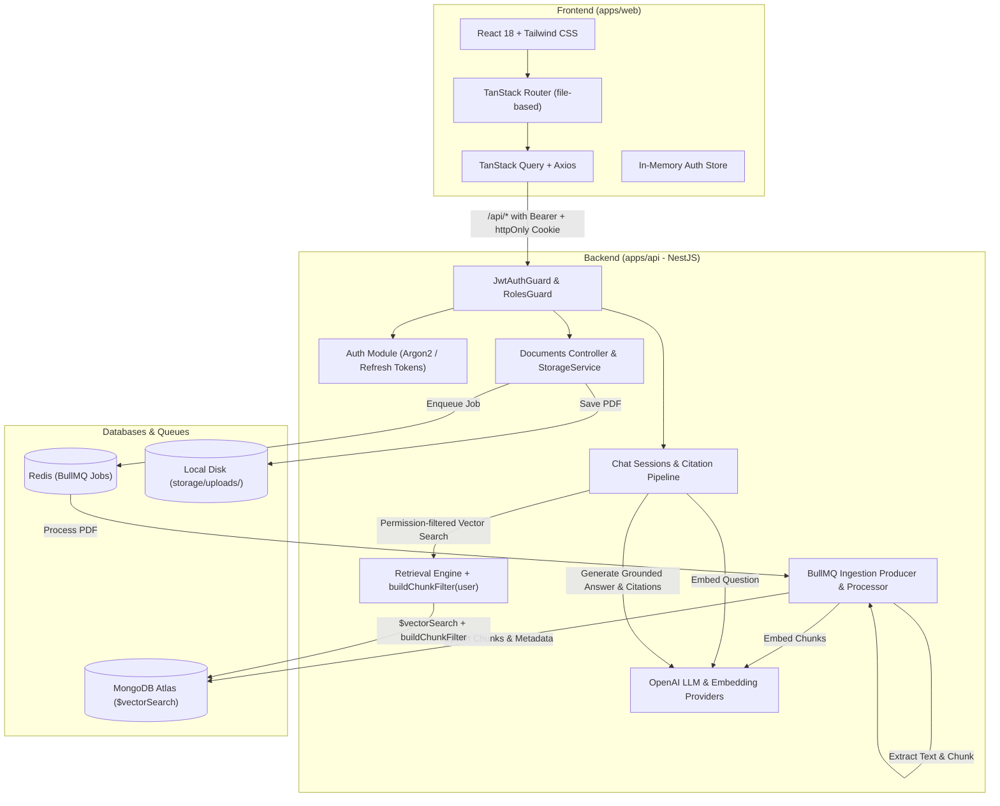

# School ERP Copilot Architecture

A role-aware RAG assistant embedded in a School ERP system.

## System Overview

## Security & Permission Model

The access rule is strictly enforced at retrieval time via `buildChunkFilter(user)`:

- **ADMIN**: Accesses all document chunks (`{}`).
- **TEACHER**: Accesses chunks where `allowedRoles: TEACHER` and `classScope` matches assigned classes or `'ALL'`.
- **PARENT**: Accesses chunks where `allowedRoles: PARENT` and `classScope` matches the child's classes or `'ALL'`.

Permission filters are injected directly into the `$vectorSearch` filter parameter, guaranteeing that unauthorized chunks are never sent to the LLM prompt.
