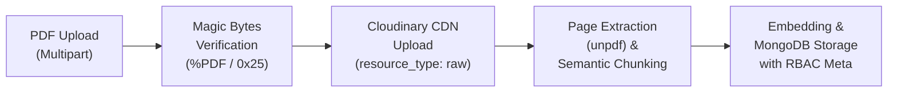

# School ERP Copilot: Complete Technical Explainer & Architecture Guide

A comprehensive, interview-ready guide explaining the end-to-end architecture, role-governed retrieval algorithms, data pipelines, security guarantees, and real-world examples of **School ERP Copilot**.

---

## 1. Executive Summary & Problem Statement

### The Problem in Educational Institutions

K-12 schools, colleges, and educational ERP platforms deal with hundreds of semi-structured PDF documents every academic year: fee circulars, examination schedules, disciplinary policies, medical emergency guidelines, and confidential staff handbooks.

Traditional chatbots and generic RAG (Retrieval-Augmented Generation) implementations suffer from two critical flaws:

1. **AI Hallucinations**: Fabricating dates, fee deadlines, or exam rules when the knowledge base is sparse.
2. **Permission Leakage (The Fatal Flaw)**: A parent asking _"What is the teacher leave policy or salary matrix?"_ might receive confidential faculty documents because the vector database lacks hardware-isolated Role-Based Access Control (RBAC).

### The Solution: School ERP Copilot

**School ERP Copilot** is a production-grade, role-aware RAG assistant embedded into a School ERP. It enforces **Pre-Retrieval Zero-Trust RBAC**:

- Every document chunk inherits the exact permission boundaries (`allowedRoles`, `classScope`) of the parent document.
- Queries are filtered **inside the database engine** _before_ vector similarity search occurs.
- Responses are strictly grounded with verifiable line-level citations `[1]` and direct Cloud CDN PDF preview links.

```
                           ┌───────────────────────────────┐
                           │   School ERP Copilot Pitch    │
                           └───────────────┬───────────────┘
                                           │
         ┌─────────────────────────────────┼─────────────────────────────────┐
         ▼                                 ▼                                 ▼
┌─────────────────┐              ┌───────────────────┐             ┌──────────────────┐
│ Zero-Hallucination │             │ Pre-Retrieval RBAC│             │ Interactive CDN  │
│ Strict ground rules             │ Physical separation               │ PDF line-level   │
│ & instant refusal               │ of role data inside               │ citations linked │
│ on absent info.                 │ MongoDB database.                 │ to Cloudinary.   │
└─────────────────┘              └───────────────────┘             └──────────────────┘
```

---

## 2. High-Level System Architecture

The project is built as a modular **pnpm monorepo** with three primary packages:

- **`packages/shared`**: Single source of truth for DTOs, schemas, enums, and permission interfaces (compiled to dual ESM/CJS).
- **`apps/api`**: Enterprise **NestJS 10** REST API, BullMQ ingestion workers, JWT authentication, and RAG retrieval engine.
- **`apps/web`**: **React 18** Single Page Application with TanStack Router, TanStack Query, and Tailwind CSS.

```mermaid
flowchart TB
    subgraph Client ["Frontend (apps/web on Vercel)"]
        UI["React 18 + Tailwind CSS"]
        Router["TanStack Router (File-based)"]
        Query["TanStack Query Cache"]
        ClientAuth["In-Memory Auth Store"]
    end

    subgraph API ["Backend Engine (apps/api on Render)"]
        Guards["JwtAuthGuard & RolesGuard"]
        DocController["Documents Controller"]
        IngestionWorker["Ingestion Pipeline (unpdf + Chunker)"]
        RetrievalEngine["Retrieval Engine (buildChunkFilter)"]
        ChatEngine["Chat Service (History + Citation Parser)"]
    end

    subgraph CloudServices ["Cloud Infrastructure & Databases"]
        Mongo[("MongoDB Atlas M0\n($vectorSearch + Chunks)")]
        Cloudinary["Cloudinary CDN\n(Permanent Raw PDF Storage)")]
        Groq["Groq Cloud LLM\n(openai/gpt-oss-120b)"]
    end

    UI --> Router
    Router --> Query
    Query -->|"HTTPS /api/*\n(Bearer Token)"| Guards

    Guards --> DocController
    Guards --> ChatEngine

    DocController -->|"1. Upload PDF"| Cloudinary
    DocController -->|"2. Extract & Chunk"| IngestionWorker
    IngestionWorker -->|"3. Embed & Upsert Chunks"| Mongo

    ChatEngine -->|"4. Permission Filter + Search"| RetrievalEngine
    RetrievalEngine -->|"5. $vectorSearch + $regex"| Mongo
    ChatEngine -->|"6. Prompt + Filtered Context"| Groq
    Groq -->|"7. Stream Answer + [1] Citations"| UI
```

---

## 3. Deep-Dive: The 3 Core Architectural Pillars

---

### Pillar 1: Ingestion & Cloud Storage Pipeline

When a School Administrator uploads an institutional document (e.g. `Fee_Structure_2026.pdf`), it passes through a 5-stage secure processing pipeline:



#### Step 1: Binary Magic-Byte Validation

Rather than trusting the browser file extension `.pdf`, the server inspects the first 4 bytes of the binary buffer:

- Must equal `0x25 0x50 0x44 0x46` (ASCII: `%PDF`).
- Maximum file size: **20 MB**.
- Disguised `.exe`, `.sh`, or corrupt files are rejected with `400 Bad Request` before reaching disk or cloud.

#### Step 2: Cloud Storage CDN Archival

The PDF buffer is uploaded directly to **Cloudinary** using a streaming buffer pipeline:

```typescript
const result = await cloudinary.uploader.upload_stream({
  resource_type: 'raw',
  folder: 'school_erp_documents',
});
```

This returns a permanent public HTTPS CDN URL stored in MongoDB (`fileUrl`). Users can click this to view the document in real time.

#### Step 3: Semantic Chunking with Context Preservation

Text is extracted page-by-page using `unpdf`. Rather than slicing at arbitrary character counts (which cuts sentences in half), our **Semantic Chunking Algorithm**:

1. Splits on natural paragraph breaks (`\n\n`) and sentence endings (`. `, `? `, `! `).
2. Maintains a target chunk size of **~2,400 characters** with a **400-character sliding overlap**.
3. Prepends a contextual header to every single chunk:
   ```text
   Document: Leave Policy 2026 (Page 2)

   Casual leave entitlement for full-time faculty is 12 days per academic calendar...
   ```
   _Why this matters_: When vector search looks for _"casual leave"_, the LLM knows precisely which document and page this fact came from without hallucination.

#### Step 4: Metadata Denormalization

Each chunk is saved in the `documentchunks` collection with denormalized security fields:

```json
{
  "_id": "6740a1b2c3d4e5f6...",
  "documentId": "6740a1b0...",
  "documentTitle": "Class 8 Term 2 Exam Circular",
  "text": "Document: Class 8 Term 2 Exam Circular (Page 1)\n\nMathematics Exam is scheduled on Nov 15...",
  "page": 1,
  "chunkIndex": 0,
  "allowedRoles": ["TEACHER", "PARENT"],
  "classScope": ["class_8_id"],
  "embedding": [0.0124, -0.0451, ..., 0.0892]
}
```

---

### Pillar 2: Role-Governed Retrieval Engine (Zero-Leakage Guarantee)

#### Why "Post-Retrieval Filtering" Fails

Many naive RAG architectures perform vector search over the entire database, fetch the Top 10 chunks, and then filter out unauthorized documents in application code.

**The Fatal Flaw**: If an attacker asks _"What is the Principal's secret bonus policy?"_, the top 10 vector results will all be confidential chunks. When application code filters them out, 0 results remain, or worse, partial snippets leak into the context window.

#### Our Approach: Pre-Retrieval Hardware Filtering

In School ERP Copilot, unauthorized chunks **never leave the database**. We use `buildChunkFilter(user)` as the single source of truth:

```typescript
export function buildChunkFilter(user: UserContext): FilterQuery<DocumentChunk> {
  // 1. Administrators see all documents
  if (user.role === Role.ADMIN) {
    return {};
  }

  // 2. Teachers see documents assigned to TEACHER role and their assigned classes
  if (user.role === Role.TEACHER) {
    return {
      allowedRoles: { $in: [Role.TEACHER] },
      classScope: { $in: ['ALL', ...user.classIds] },
    };
  }

  // 3. Parents see documents assigned to PARENT role and their child's enrolled classes
  if (user.role === Role.PARENT) {
    return {
      allowedRoles: { $in: [Role.PARENT] },
      classScope: { $in: ['ALL', ...user.classIds] },
    };
  }

  throw new ForbiddenException('Invalid user role');
}
```

#### Hybrid Retrieval (Vector Search + Keyword Fallback)

To ensure reliable retrieval across both semantic queries and exact entity searches (e.g. searching a specific student name _"Anjani"_ or document code _"CIR-2026"_):

1. **MongoDB Atlas `$vectorSearch`**: Computes cosine similarity between user query vector and candidate chunk vectors within the pre-filtered role boundary.
2. **Deterministic Keyword Matcher**: Concurrently queries `$regex` patterns over document title and chunk content, filtering out English stop-words.
3. Chunks are deduplicated and sorted by relevance score, guaranteeing accurate hits even when queries use exact acronyms.

---

### Pillar 3: Guardrailed Generation & Interactive Citations

Once the authorized Top-K chunks are retrieved, they are injected into an isolated LLM system prompt:

```text
You are School ERP Copilot, an institutional AI assistant.
Answer the user's inquiry STRICTLY using the retrieved context snippets below.

RULES:
1. If the answer cannot be found in the provided context, you MUST state:
   "I could not find information regarding this in the authorized school documents."
2. Never extrapolate, speculate, or utilize external knowledge.
3. Every factual statement must cite its source in brackets: [1], [2].
```

#### Footnote Normalization & Citation Parsing

Different LLMs format citations differently:

- OpenAI outputs standard `[1]`.
- Groq / open-source models occasionally output Unicode tool footnotes like `【1†source】`.

Our `ChatService` citation parser normalizes all Unicode citations into structured DTOs:

```json
{
  "message": {
    "role": "assistant",
    "content": "Term 2 tuition fees are due on November 10, 2026 [1]. A late penalty of $25 applies after the deadline [1].",
    "citations": [
      {
        "documentId": "6740a1b0...",
        "title": "Fee Structure & Payment Schedule 2026",
        "page": 1,
        "chunkId": "6740a1b2..."
      }
    ],
    "refused": false
  }
}
```

In the frontend, these appear as **interactive clickable chips**: clicking opens the Cloudinary PDF directly to that exact page.

---

## 4. Concrete Real-World Examples

---

### Example 1: Staff Leave Policy (Teacher vs. Parent Access)

#### Document Ingestion Settings

- **Title**: `Faculty Leave Entitlement & Compensation 2026`
- **Audience Roles**: `[TEACHER, ADMIN]`
- **Class Scope**: `ALL`

```
                                 [Staff Leave Policy]
                                    Roles: [TEACHER]
                                           │
                    ┌──────────────────────┴──────────────────────┐
                    ▼                                             ▼
          User: Teacher (Math)                         User: Parent (Smith)
     Q: "How many medical leaves?"               Q: "How many medical leaves?"
                    │                                             │
      buildChunkFilter applies:                     buildChunkFilter applies:
      allowedRoles: { $in: [TEACHER] }              allowedRoles: { $in: [PARENT] }
                    │                                             │
             Chunk Matched!                                0 Chunks Matched!
                    │                                             │
                    ▼                                             ▼
        "Full-time faculty receive                      "I could not find information
         10 medical leaves [1]."                         regarding this in authorized
         Source: Faculty Leave Policy, p.2               school documents."
```

- **Teacher Experience**: Allowed. Receives instant grounded answer citing Page 2.
- **Parent Experience**: Blocked. The database returns zero matching chunks. LLM refuses cleanly without disclosing the policy even exists.

---

### Example 2: Class Scope Isolation (Class 8 vs. Class 6 Circular)

#### Document Ingestion Settings

- **Title**: `Class 8 Mathematics Midterm Syllabus & Timetable`
- **Audience Roles**: `[PARENT, TEACHER]`
- **Class Scope**: `["class_8_A"]` _(Restricted strictly to Class 8)_

#### Scenario A: Parent with Child in Class 8

- **User**: `parent.smith@school.local` (Linked student in Class 8-A).
- **Filter**: `classScope: { $in: ['ALL', 'class_8_A'] }`.
- **Query**: _"When is the Mathematics exam scheduled?"_
- **Database Query Result**: Chunk matched (`classScope` matches `class_8_A`).
- **Answer**: _"The Class 8 Mathematics exam will take place on November 15, 2026 from 9:00 AM to 11:30 AM [1]."_

#### Scenario B: Parent with Child in Class 6

- **User**: `parent.doe@school.local` (Linked student in Class 6-A).
- **Filter**: `classScope: { $in: ['ALL', 'class_6_A'] }`.
- **Query**: _"When is the Mathematics exam scheduled?"_
- **Database Query Result**: **0 chunks**. The Class 8 document is excluded at the database level.
- **Answer**: _"I could not find information regarding the Mathematics exam schedule in the documents available to your class."_

---

### Example 3: Document Replacement & Cloud CDN Cleanup

When a school policy changes (e.g. `Fee_Structure_v1.pdf` $\rightarrow$ `Fee_Structure_v2.pdf`):

1. Admin clicks **Replace Document** in the Admin Data Grid.
2. The server:
   - Deletes the previous raw PDF from **Cloudinary** using its `public_id`.
   - Purges all old chunk embeddings from `documentchunks`.
   - Uploads the new PDF to Cloudinary and generates new vector embeddings.
   - Increments document `version: 2`.
3. Ensures zero ghost chunks or stale pricing data remain in the RAG index.

---

## 5. Technical Decision Matrix (Why We Chose X over Y)

| Decision               | Chosen Technology                      | Alternatives Considered        | Rationale                                                                                                                                                                   |
| :--------------------- | :------------------------------------- | :----------------------------- | :-------------------------------------------------------------------------------------------------------------------------------------------------------------------------- |
| **Vector Database**    | **MongoDB Atlas Vector Search**        | Pinecone, Weaviate, Milvus     | Prevents dual-write bugs. Document metadata (users, classes, documents) and vector embeddings live in the exact same ACID transactional database. 100% free tier.           |
| **LLM Provider**       | **Groq Cloud (`openai/gpt-oss-120b`)** | Direct OpenAI gpt-4o           | 100% free API tier with ultra-low latency (~200ms time-to-first-token) and generous daily token allowances. Compatible with OpenAI SDK.                                     |
| **Cloud File Storage** | **Cloudinary CDN (Raw Storage)**       | Local filesystem, AWS S3       | Cloudinary provides a free tier with 25GB storage, instant HTTPS public CDN URLs, and automated cleanup APIs. Eliminates local disk coupling in containerized deployments.  |
| **Frontend Routing**   | **TanStack Router + Query**            | React Router v6, Next.js       | 100% type-safe search params, automatic route loaders, zero layout re-rendering, and intelligent caching with query invalidation.                                           |
| **Authentication**     | **Dual-Token JWT + Family Rotation**   | Session cookies only, NextAuth | Stateless horizontal scaling. 15-minute in-memory access token prevents XSS token theft; 7-day httpOnly refresh token with reuse detection protects against replay attacks. |

---

## 6. How to Explain This Project in an Interview (Cheat Sheet)

If an interviewer asks: _"Tell me about the most technically challenging project on your resume."_

### Step 1: Context & Core Architecture

> _"I designed and built **School ERP Copilot**, a role-governed RAG assistant that allows educational institutions to query hundreds of school circulars and handbooks without hallucination or data leakage._
>
> _It's built as a TypeScript monorepo with a NestJS 10 backend, React 18 frontend, MongoDB Atlas Vector Search, and Groq/OpenAI for inference."_

### Step 2: The Core Engineering Challenge (RBAC in RAG)

> _"The biggest challenge in enterprise RAG is ensuring that unauthorized users cannot prompt-inject or retrieve documents outside their clearance level—for example, parents querying confidential faculty salaries._
>
> _Instead of naive post-retrieval filtering which can be starved of results, I built a **Pre-Retrieval Zero-Trust pipeline**. Permissions (`allowedRoles` and `classScope`) are denormalized onto every single vector chunk in MongoDB. The search query injects these security boundaries directly into MongoDB's `$vectorSearch` filter, mathematically guaranteeing that unauthorized data never leaves the database engine."_

### Step 3: Production Hardening & Testing

> _"To ensure enterprise robustness, I implemented client and server magic-byte verification for uploaded PDFs, semantic paragraph chunking with sliding overlap, and Cloudinary CDN storage with automated asset lifecycle cleanup._
>
> _I backed the entire system with an automated 8-scenario E2E security test suite validating zero permission leakage, cross-user session isolation, and non-admin endpoint rejection."_
